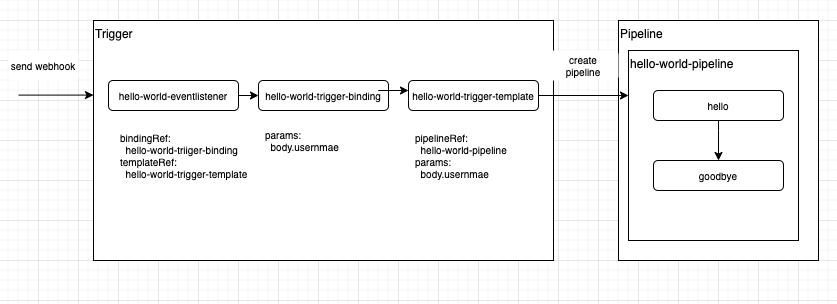

# tekton-hello-world
 This repogistry builts tekton pipeline and trigger with hello world. It can be deployed below command lines.



```
kubectl apply -f pipelines/

kubectl apply -f tasks/

kubectl apply -f triggers/

kubectl port-forward service/el-hellow-world-eventlistener 8081:8080 &

curl localhost:8081 -d '{"username": "Tekton"}'
```